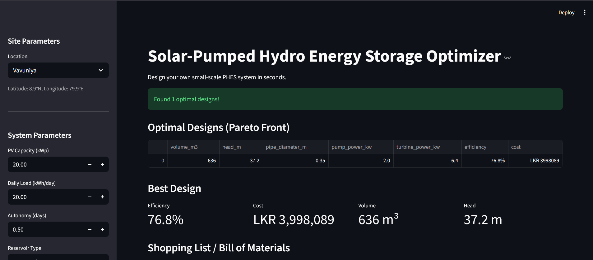
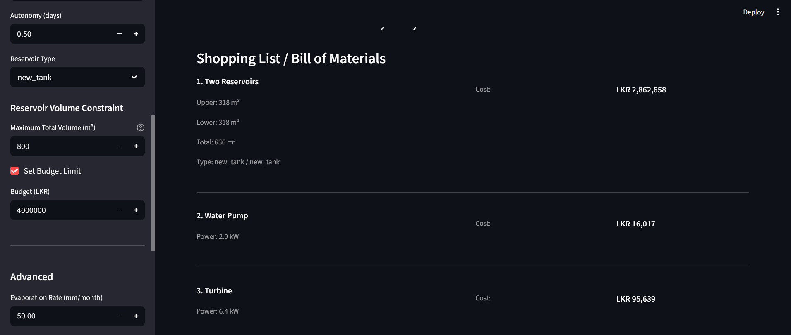

````markdown
# ⚡ Solar-Pumped Hydro Energy Storage (PHES) Optimizer

An interactive optimization framework for designing **small-scale, solar-integrated Pumped Hydro Energy Storage (PHES)** systems. The framework combines a detailed **physics-based simulator** with an **XGBoost machine learning surrogate model** to rapidly identify cost-effective and energy-efficient PHES designs for homes, farms, rural communities, and islands.

---

## 🚀 Key Features

- **Physics-Based Simulator**
  - Simulates an entire **8760-hour (1-year)** operation.
  - Models:
    - Pipe friction losses
    - Evaporation losses
    - Seepage losses
    - Variable pump efficiency
    - Variable turbine efficiency

- **Machine Learning Surrogate**
  - XGBoost model trained using **3200+ simulation samples**
  - Evaluates candidate designs almost instantly
  - Typical optimization time: **under 10 seconds**

- **Dual Optimization Modes**
  - ⚡ **ML Surrogate (Fast)** – Rapid optimization for design exploration
  - 🔬 **Physics Simulator (Slow)** – Higher accuracy using the full simulator

- **Multi-Objective Optimization**
  - NSGA-II evolutionary algorithm
  - Simultaneously:
    - Maximizes round-trip efficiency
    - Minimizes capital cost

- **Interactive Streamlit Web Application**
  - No programming knowledge required
  - User-friendly interface
  - Generates complete optimized designs
  - Produces an estimated shopping list and cost breakdown

- **Real-World Focus**
  - Designed for Sri Lankan locations
  - Tropical climate modelling
  - Supports multiple reservoir types:
    - `new_tank`
    - `excavated`
    - `pond`
    - `river`

---
## 📸 Application Preview



---



---


---

# 📁 Project Structure

```text
PHES-optimization-framework/
│
├── app.py                          # Main Streamlit application
│
├── src/
│   ├── simulator.py                # 8760-hour physics simulator
│   ├── physics.py                  # Physical equations
│   ├── cost_model.py               # Capital cost estimation
│   ├── solar_data_loader.py        # Solar data using PVlib
│   ├── user_inputs.py              # User input model
│   └── constants.py                # Physical constants
│
├── optimization/
│   ├── optimization.py             # NSGA-II using ML surrogate
│   └── optimization_physics.py     # NSGA-II using physics simulator
│
├── scripts/
│   ├── generate_dataset.py         # Dataset generation
│   └── train_surrogate.py          # Train XGBoost model
│
├── models/                         # Trained ML models
├── data/                           # Generated datasets
├── Requirements.txt                # Python dependencies
└── README.md
```

---

# 🛠 Installation

## 1. Clone the Repository

```bash
git clone https://github.com/UserLasa73/PHES-optimization-framework.git
cd PHES-optimization-framework
```

## 2. Create a Virtual Environment (Recommended)

### Windows

```bash
python -m venv venv
venv\Scripts\activate
```

### Linux / macOS

```bash
python -m venv venv
source venv/bin/activate
```

## 3. Install Dependencies

```bash
pip install -r Requirements.txt
```

---

# ▶️ Usage

Launch the Streamlit application:

```bash
streamlit run app.py
```

---

## Using the Application

### Step 1 – Enter Site Information

Provide:

- Location
- Solar PV capacity (kWp)
- Daily energy demand (kWh/day)
- Required autonomy (days)
- Reservoir type

Optional constraints:

- Maximum reservoir volume
- Budget
- Minimum efficiency

---

### Step 2 – Select Optimization Mode

Choose one of the following:

- **ML Surrogate (Fast)** ⚡
  - Rapid optimization
  - Ideal for exploring multiple design options

- **Physics Simulator (Slow)** 🔬
  - Uses the full 8760-hour simulator
  - Higher accuracy
  - Suitable for validation

---

### Step 3 – Run Optimization

Click **Optimize Design**.

The application will generate:

- ✅ Optimal PHES design
- ✅ Pareto front
- ✅ Performance statistics
- ✅ Estimated shopping list
- ✅ Cost breakdown

---

# 📊 Example Result

**Sample Input**

| Parameter | Value |
|-----------|------:|
| Location | Vavuniya |
| PV Capacity | 20 kWp |
| Daily Load | 20 kWh/day |
| Autonomy | 0.5 days |
| Reservoir Type | new_tank |
| Max Volume | 800 m³ |
| Budget | LKR 4,000,000 |
| Minimum Efficiency | 70% |

---

### Optimal Design

```text
======================================================================
OPTIMAL DESIGN
======================================================================

Mode                : ML Surrogate (Fast)
Location            : Vavuniya
PV Capacity         : 20.0 kWp
Daily Load          : 20.0 kWh/day
Autonomy            : 0.5 days
Reservoir Type      : new_tank
Maximum Volume      : 800 m³
Budget              : LKR 4,000,000
Efficiency Target   : 70%

----------------------------------------------------------------------
BEST DESIGN

Reservoir Volume    : 423 m³
Head Height         : 41.4 m
Pipe Diameter       : 0.259 m
Pump Power          : 5.3 kW
Turbine Power       : 8.2 kW

Round-trip Efficiency : 76.5%
Estimated Cost        : LKR 3,480,316

======================================================================
```

Optimization completed in **under 10 seconds** using the **ML Surrogate** mode.

---

# 🤖 Training the Machine Learning Surrogate

To generate a new dataset:

```bash
python scripts/generate_dataset.py
```

> Approximate runtime: **30–60 minutes**

Train the XGBoost surrogate model:

```bash
python scripts/train_surrogate.py
```

The trained model will be saved inside the **models/** directory.

---

# 🧰 Technologies Used

- Python
- Streamlit
- XGBoost
- DEAP (NSGA-II)
- PVlib
- NumPy
- Pandas
- Plotly
- SciPy

---

# 📄 License

This project is licensed under the **MIT License**.

---

# 🙏 Acknowledgments

This project was developed as part of a **BSc (Hons) in Information Technology** research project at the **University of Vavuniya, Sri Lanka**.

Special thanks to the developers and maintainers of:

- Streamlit
- XGBoost
- DEAP
- PVlib
- Plotly
- NumPy
- Pandas
- SciPy

whose open-source libraries made this research possible.
````
